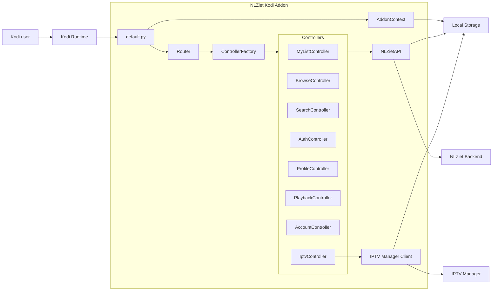

# Architecture Overview

This document gives a lightweight C4-style component view of the addon structure on the current refactor branch.

The goal of this diagram is to make the refactoring direction easier to understand during review. It is not intended as a full redesign of the addon. The main goal of the current refactor is to keep existing behaviour intact while making the codebase easier to navigate, test and maintain.

## Component Diagram

## Main Components

- `default.py` remains the Kodi entrypoint and compatibility layer.
- `AddonContext` collects Kodi runtime context such as addon metadata, handle, base URL and parsed parameters.
- `Router` handles route dispatch based on plugin parameters.
- `ControllerFactory` wires route handlers to the relevant controllers.
- Controllers group route behaviour by responsibility, such as browsing, search, profiles and My List.
- `NLZietAPI` remains responsible for communication with the NLZiet backend.
- `IPTV Manager Client` handles IPTV Manager integration.
- Local storage is used for addon data such as settings, cached data, profiles, cookies and tokens.

## Current Refactor Scope

The initial refactor intentionally focuses on low-risk structure:

- routing
- context handling
- controller extraction
- tests around extracted pieces

Authentication, playback, DRM/InputStream Adaptive handling, and token/cookie persistence are intentionally kept out of scope for the first low-risk refactor steps.
